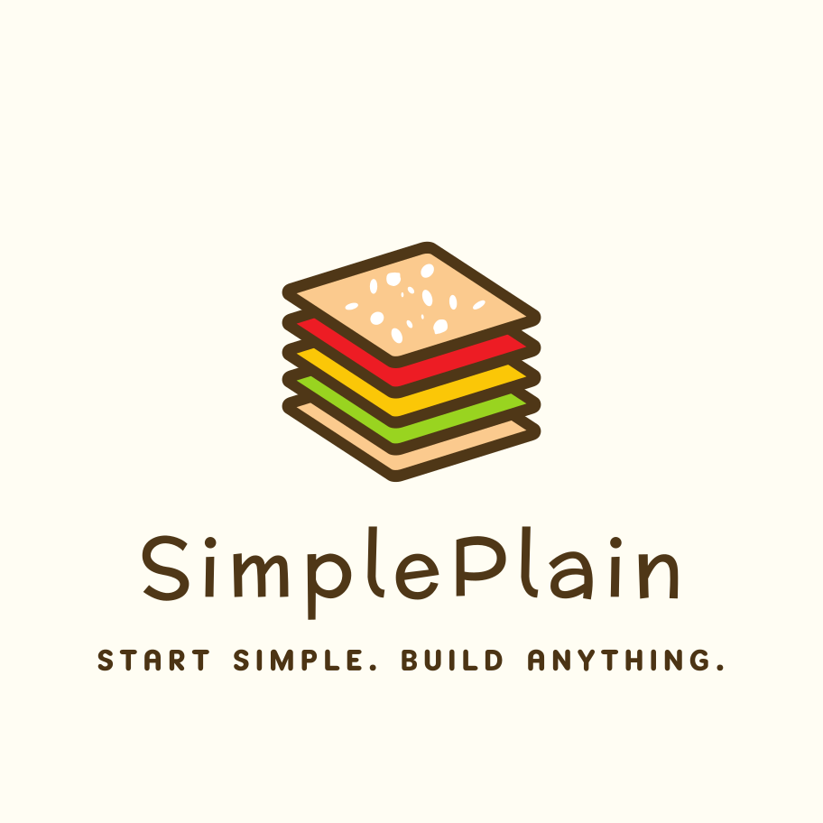

<a id="readme-top"></a>

<!-- PROJECT LOGO -->
<br />
<div align="center">
  <a href="https://github.com/pm25/simpleplain">
    
  </a>

  <h3 align="center">SimplePlain - A Personal Website Template</h3>

  <p align="center">
    Build your personal website effortlessly with <strong>SimplePlain</strong>!  This template is designed for easy customization and is perfect for showcasing your portfolio — whether you're a researcher, engineer, or student.
    <br />
    <br />
    <a href="https://pm25.github.io/simpleplain">🌐 Live Demo</a>
    ·
    <a href="https://github.com/pm25/simpleplain/issues/new?labels=bug&template=bug-report---.md">🐞 Report Bug</a>
    ·
    <a href="https://github.com/pm25/simpleplain/issues/new?labels=enhancement&template=feature-request---.md">💡 Request Feature</a>
  </p>
</div>

<p align="center">
  🚧 This project is still under construction! 🚧
</p>

<!-- TABLE OF CONTENTS -->
<details>
  <summary>Table of Contents</summary>
  <ol>
    <li><a href="#about-the-template">About The Template</a></li>
    <li><a href="#preview">Preview</a></li>
    <li><a href="#getting-started">Getting Started</a></li>
    <li><a href="#usage">Usage</a></li>
    <li><a href="#roadmap">Roadmap</a></li>
    <li><a href="#contributing">Contributing</a></li>
    <li><a href="#license">License</a></li>
    <li><a href="#contact">Contact</a></li>
    <li><a href="#acknowledgments">Acknowledgments</a></li>
  </ol>
</details>

<!-- ABOUT THE PROJECT -->

## About The Template

Having a personal website is essential in today's world—it’s a great way to showcase your portfolio, share your experiences, and highlight your projects so others can get to know you better. However, building a personal website from scratch can be time-consuming, especially for those without web development experience.

🍞SimplePlain was originally created for my own personal website, but I realized it’s also useful for quick personal website setup. That’s why I’m sharing it, hoping it can benefit others. It’s designed to be easy to set up while maintaining flexibility for customization. Whether you're just getting started or looking for a solid foundation to build upon, SimplePlain is a great choice. It’s user-friendly for both experienced web developers and beginners alike.

If you find this template helpful, feel free to leave a ⭐ to support the project!

### 🛠️ Built With

This project is primarily built using the following frameworks and libraries:

-   [![React][React.js]][React-url]
-   [![Vite][Vite]][Vite-url]
-   [![Tailwind CSS][Tailwind.css]][Tailwind-url]
-   [![Typescript][Typescript]][Typescript-url]
-   [![shadcn/ui][shadcn.ui]][shadcn-url]

<p align="right"><a href="#readme-top">⬆️ Back to top</a></p>

## Preview

See how 🍞SimplePlain looks in both light and dark themes:

### ☀️ Light Mode

![Light Mode][screenshot-light]

### 🌙 Dark Mode

![Dark Mode][screenshot-dark]

<p align="right"><a href="#readme-top">⬆️ Back to top</a></p>

<!-- GETTING STARTED -->

## Getting Started

Follow these steps to set up and run the project locally, and deploy it to GitHub Pages.

### ✅ Prerequisites

Make sure you have [Node.js](https://nodejs.org/) and npm installed. You can update npm to the latest version using:

```sh
npm install npm@latest -g
```

### 🛠️ Installation

1. **Clone the repository**

```sh
git clone https://github.com/pm25/simpleplain.git
cd simpleplain
```

2. **Install dependencies**

```sh
npm install
```

3. **Start the development server**

```sh
npm run dev
```

This will start the Vite development server. Open [http://localhost:5173](http://localhost:5173) to view it in the browser.

### 🚀 Deployment

To publish the site to GitHub Pages:

```sh
npm run deploy
```

### 💡 Notes

* If you’re forking or cloning this repo as a template, it’s recommended to update the git remote:

```sh
git remote set-url origin https://github.com/<your-username>/<your-repo>.git
git remote -v # Confirm the changes
```

<p align="right"><a href="#readme-top">⬆️ Back to top</a></p>

<!-- USAGE EXAMPLES -->

## Usage

Use this space to show useful examples of how a project can be used. Additional screenshots, code examples and demos work well in this space. You may also link to more resources.

_For more examples, please refer to the [Documentation](https://example.com)_

<p align="right"><a href="#readme-top">⬆️ Back to top</a></p>

<!-- ROADMAP -->

## Roadmap

-   [x] Add Changelog
-   [x] Add back to top links
-   [ ] Add Additional Templates w/ Examples
-   [ ] Add "components" document to easily copy & paste sections of the readme
-   [ ] Multi-language Support
    -   [ ] Chinese
    -   [ ] Spanish

See the [open issues](https://github.com/othneildrew/Best-README-Template/issues) for a full list of proposed features (and known issues).

<p align="right"><a href="#readme-top">⬆️ Back to top</a></p>

<!-- CONTRIBUTING -->

## Contributing

Contributions are what make the open source community such an amazing place to learn, inspire, and create. Any contributions you make are **greatly appreciated**.

If you have a suggestion that would make this better, please fork the repo and create a pull request. You can also simply open an issue with the tag "enhancement".
Don't forget to give the project a star! Thanks again!

1. Fork the Project
2. Create your Feature Branch (`git checkout -b feature/AmazingFeature`)
3. Commit your Changes (`git commit -m 'Add some AmazingFeature'`)
4. Push to the Branch (`git push origin feature/AmazingFeature`)
5. Open a Pull Request

<!-- LICENSE -->

## License

Distributed under the MIT License. See `LICENSE` for more information.

<p align="right"><a href="#readme-top">⬆️ Back to top</a></p>

<!-- CONTACT -->

## Contact

Pin-Yen Huang - [pyhuang97@gmail.com](mailto:pyhuang97@gmail.com)

Project Link: [https://github.com/pm25/simpleplain](https://github.com/pm25/simpleplain)

<p align="right"><a href="#readme-top">⬆️ Back to top</a></p>

<!-- ACKNOWLEDGMENTS -->

## Acknowledgments

I am deeply grateful for the following tools and resources that contributed to the development of this project:

-   [React Icons](https://react-icons.github.io/react-icons)
-   [Best README Template](https://github.com/othneildrew/Best-README-Template)

<p align="right"><a href="#readme-top">⬆️ Back to top</a></p>

<!-- MARKDOWN LINKS & IMAGES -->
<!-- https://www.markdownguide.org/basic-syntax/#reference-style-links -->

[screenshot-light]: preview/light-mode.webp
[screenshot-dark]: preview/dark-mode.webp
[React.js]: https://img.shields.io/badge/React-20232A?style=for-the-badge&logo=react&logoColor=61DAFB
[React-url]: https://react.dev
[shadcn.ui]: https://img.shields.io/badge/shadcn/ui-000000?style=for-the-badge&logo=shadcn/ui&logoColor=white
[shadcn-url]: https://ui.shadcn.com
[Tailwind.css]: https://img.shields.io/badge/Tailwind_CSS-grey?style=for-the-badge&logo=tailwind-css&logoColor=38B2AC
[Tailwind-url]: https://tailwindcss.com
[Typescript]: https://img.shields.io/badge/TypeScript-3178C6?style=for-the-badge&logo=typescript&logoColor=white
[Typescript-url]: https://www.typescriptlang.org
[Vite]: https://img.shields.io/badge/Vite-646CFF?style=for-the-badge&logo=Vite&logoColor=white
[Vite-url]: https://vite.dev
